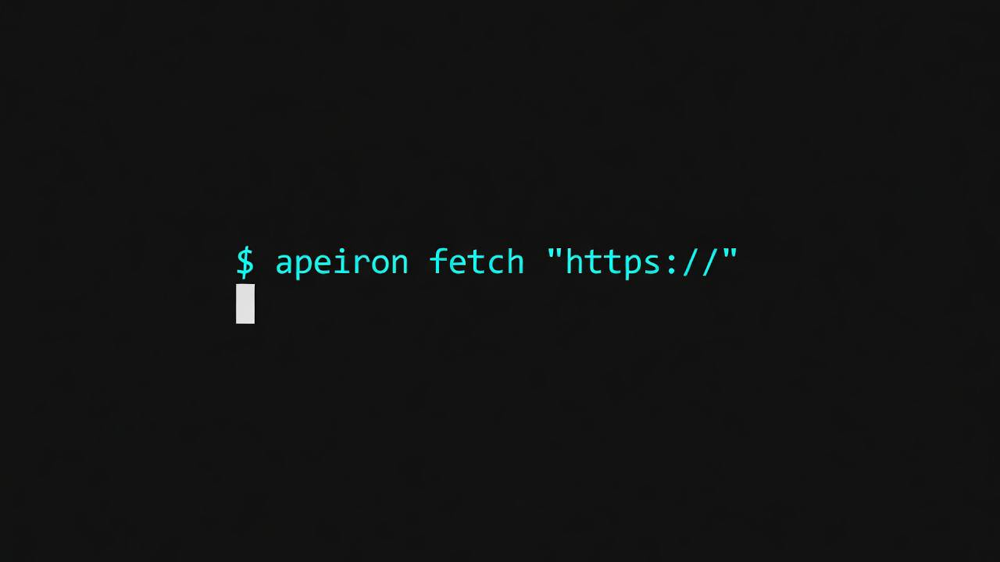

<p align="center">
  
</p>

<h1 align="center">Apeiron</h1>

<p align="center">
  <b>Local-first web search, fetch, and extraction tools for AI agents.</b>
</p>

<p align="center">
  
  
  
</p>

Apeiron gives MCP-compatible agents and Python apps three practical tools:

- `apeiron_search`: search web-oriented sources such as arXiv, Wikipedia, GitHub, and optional local SearXNG.
- `apeiron_fetch`: fetch a URL and return LLM-ready content plus tier/verdict diagnostics.
- `apeiron_learn`: remember the best working fetch strategy for a domain.

It is designed for Claude Code, OpenCode, Cursor, Cline, Windsurf, and local agent workflows where you want a free, inspectable web-access layer before reaching for paid scraping APIs.

## Status

Works today:

- CLI, Python API, and MCP server surfaces.
- Fast HTTP fetch with `curl_cffi` when the fetch extra is installed.
- arXiv, Wikipedia, and GitHub search.
- Jina Reader fallback.
- Local response cache and per-domain strategy cache.
- Structured JSON output for CLI and MCP fetch/learn calls.
- `apeiron doctor` diagnostics for optional dependencies and local services.

Experimental:

- Browser tiers: Patchright, CloakBrowser, Camoufox, FlareSolverr, browser-use.
- PDF/DOCX/PPTX/XLSX extraction through Markitdown.
- YouTube transcript extraction through yt-dlp subtitle metadata.
- Reddit search; it is not enabled by default because Reddit requires OAuth for reliable automated use.
- Git-based shared learning; local git commits are opt-in with `APEIRON_GIT_COMMIT=true`.

## Install

The PyPI name `apeiron` belongs to a different package. Until this project is published as `apeiron-agent`, use the GitHub install path.

### Recommended

```bash
pipx install "git+https://github.com/insomnia-me/apeiron.git"
```

### From source

```bash
git clone https://github.com/insomnia-me/apeiron.git
cd apeiron
python3 -m venv .venv
source .venv/bin/activate
pip install -e ".[fetch,mcp,documents,media]"
```

### One-command local install

```bash
curl -fsSL https://raw.githubusercontent.com/insomnia-me/apeiron/main/install.sh | bash
```

Set `APEIRON_INSTALL_PROFILE=all` before running the script if you also want browser automation dependencies.

## Quickstart

```bash
apeiron doctor
apeiron fetch "https://example.com" --json
apeiron search "python web scraping" --sources wikipedia github arxiv --json
apeiron learn "https://example.com" --json
apeiron bench
apeiron init --target cursor --output .
apeiron demo
apeiron cache list
```

## Recipes

Start with [docs/recipes.md](docs/recipes.md) when you want a complete workflow instead of individual commands:

- Give Claude Desktop web search.
- Build a research agent.
- Extract PDFs into Markdown.
- Build a RAG corpus from URLs.
- Monitor docs changes.

## Web Access Score

Apeiron ships with a small reproducible benchmark that exercises public docs, HTML pages, research pages, PDF-like research URLs, and media-adjacent sources:

```bash
apeiron bench
apeiron bench --json
```

The command reports an `Apeiron Web Access Score` plus per-URL verdicts, tiers, content sizes, and failure reasons. Use it before and after installing optional extras or browser tiers to see what actually improved on your machine. See [docs/benchmarks.md](docs/benchmarks.md).

## Visual Demo

Run a local browser UI for quick URL-to-content testing:

```bash
apeiron demo
```

It opens a minimal page with a URL input, extracted content, verdict, tier, confidence, warnings, content type, and character count.

## Cache Memory

Apeiron stores successful fetch output in a local SQLite cache so repeated agent calls can reuse prior reads:

```bash
apeiron cache list
apeiron cache search "packaging"
apeiron cache clear
```

Set `APEIRON_CACHE_DB=/path/to/cache.db` to point a project or test run at an isolated cache file.

## MCP server

Example OpenCode config:

```jsonc
{
  "mcp": {
    "servers": {
      "apeiron": {
        "command": "python",
        "args": ["-m", "apeiron.api.mcp_server"],
        "cwd": "/path/to/apeiron"
      }
    }
  }
}
```

MCP tools:

| Tool | What it returns |
|---|---|
| `apeiron_search("query")` | JSON array of search hits |
| `apeiron_fetch("url")` | JSON object with content, tier, verdict, content type, title, elapsed time, and error |
| `apeiron_learn("url")` | JSON object with learned tier/verdict diagnostics |

More copy-paste integrations for Claude Desktop, Cursor, OpenCode, OpenAI Agents SDK, and plain Python agent loops are in [docs/integrations.md](docs/integrations.md).

Generate starter files directly:

```bash
apeiron init --target claude --output .
apeiron init --target cursor --output .
apeiron init --target opencode --output .
apeiron init --target openai-agents --output .
```

## Python API

```python
from apeiron import fetch_sync, search_sync

result = fetch_sync("https://example.com", cache_ttl=0)
print(result.verdict.value, result.tier.value)
print(result.content[:500])

hits = search_sync("agent web access", max_results=5)
for hit in hits:
    print(hit.source.value, hit.title, hit.url)
```

## Architecture

```text
APEIRON
  search
    arXiv, Wikipedia, GitHub, optional SearXNG
  fetch
    fast HTTP -> browser tiers -> reader fallback
  extract
    Trafilatura, Readability, Markitdown
  learn
    strategies.json, challenge heuristics, opt-in git commits
  api
    CLI, Python API, MCP server
```

## Optional infrastructure

SearXNG and FlareSolverr run through Docker Compose:

```bash
bash scripts/start-infra.sh
bash scripts/stop-infra.sh
```

Docker is optional. Apeiron can run CLI, Python API, MCP, fast fetch, and direct API search without local Docker services.

## Safety boundary

Apeiron is for fetching public URLs and converting public content into agent-friendly text. It does not authorize credential bypass, private data access, or ignoring site policies. See [SECURITY.md](SECURITY.md).

## Roadmap

- Green deterministic CI on every pull request.
- More tests around fetch tier selection and extraction.
- Larger dated benchmark table with reproducible public URL sets.
- Better browser-tier diagnostics.
- Explicit Reddit OAuth integration or removal from public source list.
